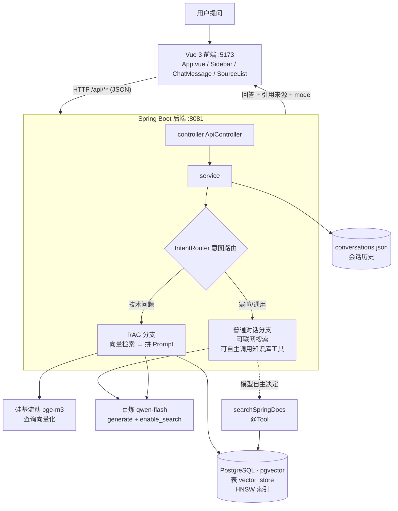

# doc-agent — 基于 Spring AI 的技术文档问答 Agent

一个面向 Spring 官方文档的智能问答系统：把文档切分、向量化后建立知识库，  
用户提问时先检索最相关的片段，再让大模型基于这些片段生成**带引用来源**的回答；  
寒暄类问题自动走普通对话，不查文档。

## 功能特性

- **RAG 检索问答**：本地文档 → 切分 → 向量化 → 相似度检索 → 增强生成
- **多轮对话记忆**：追问"那第二步呢？"也能听懂上下文（窗口 20 条）
- **引用溯源**：每条回答附来源文件、相关度分数、原文片段
- **流式输出**：回答逐字推送（SSE），不用盯着空白干等
- **意图路由**：寒暄/技术问题自动分流，闲聊不浪费检索
- **会话管理**：侧边栏新建 / 切换 / 重命名 / 删除会话，重启不丢
- **联网搜索**：百炼 `enable_search` 实时信息（天气/新闻/版本号），回答末尾列出参考链接
- **工具调用**：知识库包装成 `@Tool`，**用不用、什么时候用由模型自己决定**
- **免费模型**：对话用百炼 qwen-flash，向量用硅基流动 bge-m3，月成本约 1~3 元

## 技术栈

| 层    | 技术                                                     |
| ---- | ------------------------------------------------------ |
| 后端   | Java 17 · Spring Boot 4.1 · Spring AI 2.0（OpenAI 兼容协议） |
| 前端   | Vue 3 · Vite · markdown-it · highlight.js              |
| 对话模型 | 阿里云百炼 qwen-flash（输入 0.18 / 输出 1.8 元每百万 token） |
| 向量模型 | 硅基流动 BAAI/bge-m3（免费，1024 维）                            |
| 向量库  | PostgreSQL 16 + pgvector 0.8（Docker 容器）／ SimpleVectorStore（改一行配置可切回） |
| 会话存储 | JSON 文件落盘，规划换 MySQL                                    |

## 架构



## 目录结构

```
doc-agent
├── data/                          运行时数据（自动生成，可删可重建）
│   ├── conversations.json         全部会话历史
│   └── vector-index*.json         内存向量库模式的索引（当前用 pgvector，
│                                   这几个文件是切回 simple 时的回退备份，别删）
├── docker-compose.yml             PostgreSQL 16 + pgvector（一行命令起库）
├── tools/spring-docs/             爬取的 Spring 官方文档（87 篇 md）
├── frontend/                      Vue 3 前端（独立 npm 项目）
│   └── src/
│       ├── App.vue                主界面：状态、发消息、会话调度
│       ├── api.js                 封装所有后端请求
│       ├── markdown.js            markdown-it + highlight.js 初始化
│       ├── components/
│       │   ├── Sidebar.vue        左侧会话列表
│       │   ├── ChatMessage.vue    消息气泡 + mode 标签
│       │   ├── SourceList.vue     引用来源卡片
│       │   └── MarkdownText.vue   Markdown 渲染容器
│       └── vite.config.js         dev 代理 /api → 8081
└── src/main/java/com/example/docagent/
    ├── DocAgentApplication.java   启动类
    ├── config/RagConfig.java      Bean 装配：VectorStore、ChatMemory、切分器
    ├── controller/
    │   ├── ApiController.java     前端用 REST 接口（JSON）
    │   ├── ChatController.java    /ai/chat 调试接口
    │   └── DocController.java     /doc/** 调试接口（地址栏直调）
    ├── service/
    │   ├── DocumentService.java   加载文档、切分、向量化、索引落盘
    │   ├── RagChatService.java    问答主流程：检索 → 生成 → 记忆 → 落盘（含流式版）
│   ├── StreamSink.java        流式回调接口：让 service 不依赖 SSE/WebSocket 等传输方式
    │   ├── IntentRouter.java      意图路由（白名单 + 模型分类）
    │   └── ConversationService.java  会话历史读写
    └── dto/                       ChatRequest/Response、SourceRef、Conversation 等
```

## 快速开始

前置：JDK 17+、Node.js 18+、Docker Desktop（向量库跑在容器里）、两个 API Key：

| Key | 从哪拿 | 用途 |
|---|---|---|
| `DASHSCOPE_API_KEY` | [百炼控制台](https://bailian.console.aliyun.com/) 左侧「API-KEY」 | 对话模型（qwen-flash）+ 联网搜索 |
| `SILICONFLOW_API_KEY` | [硅基流动](https://cloud.siliconflow.cn/account/ak)（需实名） | 向量模型（bge-m3） |

> 两个 Key **缺一不可**：问技术问题要检索文档（用硅基流动），闲聊和联网要用对话模型（用百炼）。
> 配完建议先跑一次自检：`python tools\check_config.py`，它会直接告诉你是哪个环节有问题。

**0. 启动数据库**（Docker Desktop 要先双击启动，等右下角鲸鱼图标变绿）

```bash
docker compose up -d
docker compose ps             # doc-agent-pg 显示 healthy 即可
```

**1. 启动后端**（IDEA 中配置环境变量后运行 `DocAgentApplication`，或：）

```bash
DASHSCOPE_API_KEY=xxx SILICONFLOW_API_KEY=xxx ./mvnw spring-boot:run
```

**2. 启动前端**

```bash
cd frontend
npm install
npm run dev        # 打开 http://localhost:5173
```

**3. 建知识库**：页面右上点「加载文档」，等索引构建完成即可提问。
向量会写进 PostgreSQL 的 `vector_store` 表，重启后自动恢复，不用重建。

**4. 自检（可选但推荐）**

```bash
python tools\check_config.py
```

6 项体检：环境变量、配置、两个 Key 的连通性、向量库、端到端冒烟测试。
出问题时它会直接说人话（"Key 无效"、"模型名不存在"、"域名写错"），
而不是让你去猜一串 `UnauthorizedException`。

## API 一览（前缀 /api）

| 方法     | 路径                  | 说明                                    |
| ------ | ------------------- | ------------------------------------- |
| GET    | /status             | 知识库状态（片段数、模型名）                        |
| GET    | /usage              | token 用量（本次运行累计：输入/输出/次数/成本估算）      |
| POST   | /load               | 加载文档建索引（`?dir=&maxFiles=`）            |
| POST   | /chat               | 提问，body: `{conversationId, question}` |
| POST   | /chat/stream        | 提问（SSE 流式），事件：`meta`/`token`/`done`/`error` |
| GET    | /conversations      | 会话列表（摘要）                              |
| GET    | /conversations/{id} | 会话完整内容                                |
| PATCH  | /conversations/{id} | 重命名                                   |
| DELETE | /conversations/{id} | 删除会话                                  |

另有调试接口：`GET /ai/chat?q=`、`GET /doc/load?dir=&maxFiles=`、`GET /doc/ask?question=`。

## Roadmap

- [x] P1 最小 RAG 闭环：检索问答 / 多轮记忆 / 引用溯源 / 意图路由 / 前端
- [x] SSE 流式输出（打字机效果）
- [x] pgvector 替换内存向量库（已启用：HNSW 索引 + 余弦距离，切换只需改一行配置）
- [x] 限速韧性：指数退避重试 + 加载节流 + 全局异常翻译（免费模型必备）
- [ ] Tool Use（Function Calling）
- [ ] ReAct 推理-行动循环
- [ ] MCP Server 化（接入 Claude / Cursor）
- [ ] 评测集 + 检索准确率、可观测 Trace

## 向量库：PostgreSQL + pgvector

向量存进真正的数据库，由 `docker compose up -d` 一行命令拉起：

```bash
docker compose up -d          # 起 PostgreSQL 16 + pgvector 0.8（首次拉镜像 1-2 分钟）
docker compose ps             # 看到 doc-agent-pg 是 healthy 就算好了
```

应用侧由 `application.yaml` 的 `doc-agent.vector-store.type` 决定用哪套，两套都留着：

| 对比 | SimpleVectorStore（`type: simple`） | PostgreSQL + pgvector（`type: pgvector`，当前） |
|---|---|---|
| 持久化 | 靠 save/load 落盘 JSON | 本来就在库里，重启自动在 |
| 数据量 | 几千片段以内 | 十万级以上 |
| 多实例共享 | 不行 | 可以 |
| 检索加速 | 全量线性扫描 | HNSW 近似索引（`spring_ai_vector_index`） |
| 距离度量 | 余弦 | 余弦（`vector_cosine_ops`） |
| 依赖 | 无，零配置 | 需要 Docker Desktop 常驻 |

切换后必须重新点一次「加载文档」（两套库各存各的，不会自动迁移）。

**想切回内存版**：把 `type` 改回 `simple`、重启应用即可，**不需要动任何文件** ——
`data/vector-index.json` 一直原地保留着（pgvector 模式的落盘逻辑直接跳过，
从不覆盖它），切回去时那 319 个片段还在，秒级恢复。

**排查小抄**：

```bash
docker ps                                   # 容器是否 healthy
docker exec -it doc-agent-pg psql -U docagent -d docagent -c "select count(*) from vector_store;"
docker exec -it doc-agent-pg psql -U docagent -d docagent -c "\d vector_store"
docker compose stop                         # 停库（不影响代码和数据）
docker compose down -v                      # 删库（数据一并清空，慎用）
```

> 表结构由应用自动创建（`initializeSchema`），首次启动时会建 `vector_store` 表
> 和 HNSW 索引，无需手动执行 DDL。`embedding` 列是 `vector(1024)`，
> 改 embedding 模型维度时必须同步改 `doc-agent.vector-store.dimensions` 并重建索引。
>
> `id` 列是 **TEXT**（不是 UUID），因为片段主键用的是"文件名#序号"这种可读且稳定的
> ID，重复加载文档时靠主键冲突走 `ON CONFLICT DO UPDATE` 覆盖，不会插出重复数据。
> 若要改主键类型或表结构，**必须删表重建**（表里 0 行时最省事）：
> `docker exec -it doc-agent-pg psql -U docagent -d docagent -c "drop table vector_store;"`

## 免费模型的限速与自动重试

硅基流动的免费模型 `BAAI/bge-m3` 有**固定速率上限**。加载 87 篇文档会切出 319 段，
即使每批 8 段也要在几秒内打出 40 次请求，很容易撞到：

```
com.openai.errors.RateLimitException: 429: 您的账户已达速率限制，请控制请求频率
```

429 是「等一下就好」而不是「请求错了」，所以本项目做了三件事，从预防到补救：

| 层次 | 做法 | 代码位置 |
|---|---|---|
| ① 主动限速 | **客户端令牌桶**：每秒最多发 qps 个请求，超出的**排队等**，根本不会打撞服务端 | `RetryEmbeddingModel.acquirePermit()` |
| ② 主动节流 | 加载时每批 4 段、批间停顿 150ms，把请求摊开 | `DocumentService.loadDocs()` |
| ③ 自动补救 | 真的撞限速了自动重试 3 次，等待 1s → 2s → 4s 指数退避 + 随机抖动 | `RetryEmbeddingModel.withRetry()` |
| ④ 友好提示 | 3 次仍失败时返回「等 10~20 秒再试」，而不是甩一串英文 | `GlobalExceptionHandler` |

**为什么客户端限速比"被拒绝再重试"好？**
服务端拒绝是"出了错再补救"，重试期间用户看到的是失败或长时间等待；
客户端排队是"根本没打超"，用户只是觉得慢一点，但**一定成功**。

**为什么重试要加随机抖动？** 多个请求同时被限流后，如果都按固定时间重发，会再次同时触发限流，
形成「惊群」。叠加 0~500ms 随机值能打散重试时刻。

**为什么只对 429 / 5xx / 网络异常重试，401 不重试？**
401 是 Key 错了，重试 100 次结果一样 —— 让它干等 7 秒才报错是折磨。
所以 `isRetryable()` 明确把 401/403/400 归为「不可重试」，立刻失败。

**为什么用装饰器而不是改业务代码？** 真正调模型的是 Spring AI 内部的 `PgVectorStore`，
业务层插不上手。`RetryEmbeddingModel` 把原模型包一层后放回容器
（`RagConfig` 里的 `BeanPostProcessor`），**所有经过的 embedding 调用自动获得限速+重试能力**，
业务代码一行不用改，以后换模型也不用重新加。

可调参数（`application.yaml`）：

```yaml
doc-agent:
  embedding:
    qps: 4               # 客户端限速（最关键的一招），<=0 关闭
    batch-size: 4        # 每批送几段
    batch-delay-ms: 150  # 批间停顿
    max-retries: 3       # 撞限速重试几次
    retry-delay-ms: 1000 # 退避基数，实际等待 = 基数 × 2^(n-1) + 随机抖动
```

### 想换向量模型的话

当前用硅基流动 bge-m3（免费）。限速是免费服务的固有属性，代码层只能缓解不能消除。
真要换，得注意**换向量模型一定要重建索引**（向量空间变了）：

| 备选 | 成本 | 备注 |
|---|---|---|
| 换百炼 `text-embedding-v3` | 0.5 元/百万 token。重建索引一次约 **0.13 元**，之后每次提问约 **0.0004 元** | 同一个 Key 就能用；**必须重建索引** |
| 本地 Ollama 跑 bge-m3 | 免费、无限速、不依赖网络 | 装 Ollama + 下 1.2GB 模型；**必须重建索引**；面试加分项 |

> 有付费额度或换到不限速的向量服务时，把 `qps` 调大、`batch-delay-ms` 调小、`batch-size` 调大即可。

## 回答慢 / 失败怎么排查

### 先看耗时日志，不要猜

后端每个环节都会打耗时日志（IDEA 控制台可见），一眼就能定位瓶颈：

```
意图判定[关键词「starter」] xxx → TECH（未调用模型）   ← 0 次调用，最好
意图判定[模型分类，耗时 1240 ms] xxx → TECH            ← 模型分类花了 1.2 秒
会话 xxx 检索完成：命中 4 段，向量检索耗时 210 ms，资料拼装 8 ms（共 3120 字）
会话 xxx 流式完成：首字延迟 860 ms，总耗时 3400 ms，输出 412 字
```

| 指标 | 正常 | 太慢说明什么 |
|---|---|---|
| `首字延迟` | 0.5~1.5 秒 | 提示词太长（4 段资料 + 20 条历史 ≈ 3000+ token），模型读完才吐字 |
| `总耗时` | 2~5 秒 | 主要由模型生成速度决定，回答越长越慢 |
| `意图判定` | 应显示"未调用模型" | 显示"模型分类，耗时 xxx ms"说明规则没覆盖到，白等一次 |

### 一次问答到底调了几次外部接口

| 环节 | 调用 | 优化前 | 优化后 |
|---|---|---|---|
| 意图分类 | 对话模型 | **每次都调（1~2 秒）** | 规则命中时 0 次 |
| 向量检索 | 硅基流动 embedding | 1 次 | 1 次 |
| 回答生成 | 对话模型（流式） | 1 次 | 1 次 |
| 自主调工具 | 硅基流动 embedding | — | 模型决定要不要（0~1 次） |

意图分类改成「**规则优先 + 模型兜底**」后，日常技术问题**零额外调用**，
既快了 1~2 秒，也让对话模型的调用次数减半（限速风险随之减半）。

规则表在 `IntentRouter.TECH_HINTS`，命中任意一个技术关键词就直接判 TECH。

> ⚠️ 但要注意**判断权的转移**：这套规则是我写的，关键词覆盖不到就会误判
> （曾把"有什么好吃的美食"判成技术问题）。现在闲聊分支也挂了知识库工具，
> **即使路由判错，模型自己也能查文档** —— 两层保险。
> 这也是为什么后来要做 Tool Use：把最终决定权交回模型。

### 429 到底是哪个环节撞的

看报错出现在 `meta` 事件**之后**还是**之前**：

- 没收到 `meta` 就失败 → 挂在**意图判定或向量检索**
- 收到了 `meta`、正文一个字没出来就失败 → 挂在**回答生成**（对话模型）

> 一次真实的案例：界面显示"引用来源 4 条"且正文为空，说明检索已经成功（4 条来源是
> `meta` 事件带出来的），失败发生在随后的生成阶段 —— 是**对话模型限速**，
> 而当时的提示文案却写成了"向量模型限速"，把人带偏了。
> 现在错误提示会**按服务商分流**，直接告诉你是哪家的 Key 出了问题。

## 为什么要做「单并发守卫」

**这是本项目踩过最隐蔽的一个坑，也是 `GuardedChatModel` 存在的唯一理由 —— 把它留在代码里不是为了现在，而是为了将来换任何有限速的服务商时都能直接用。**

当时的背景：对话模型用的是智谱免费档，而它**只允许 1 个并发请求**。
一次问答要调它一到两次：

| 环节 | 调用 | 优化前 | 优化后 |
|---|---|---|---|
| 意图判定 | 对话模型 | **1 次** | 规则命中时 **0 次** |
| 回答生成 | 对话模型（流式） | 1 次 | 1 次 |

**为什么流式是重灾区**：所谓"1 并发"指的是**同时进行的 HTTP 请求**，
而流式请求从发出到收完最后一个 chunk 一直算"进行中"。
你在这个窗口内再发一条消息 → 立刻 429。
实测症状是：卡 60 秒后抛 `OpenAIException: Request failed`（而不是干脆的 429）。

**解法：`GuardedChatModel`（客户端串行化）**

用 `Semaphore(1)` 保证同一时刻只有一个请求打到对话模型，其余在客户端排队：

```java
public Flux<ChatResponse> stream(Prompt prompt) {
    return Flux.defer(() -> {
        if (!singleSlot.tryAcquire(120, TimeUnit.SECONDS)) { ... }
        return delegate.stream(prompt)
                .doFinally(signal -> singleSlot.release());   // 结束/异常/取消都会归还
    });
}
```

三个容易写错的点：

1. **流式必须持有信号量到流结束**。如果只在 subscribe 瞬间 acquire 就 release，
   两个流式请求还是会同时打出去。用 `Flux.defer + doFinally` 保证严格配对。
2. **排队要设超时**。万一有个流式请求卡住 3 分钟（前端 SSE 上限），
   后面全在干等。用 `tryAcquire(120s)` 而不是 `acquire()`，拿不到就立刻失败并提示用户。
3. **流式不重试**。已经推送了部分文字，重试会让用户看到两遍答案。
   串行化之后本来就不会撞 429，保持行为可预测比"更激进"重要。

> 实测验证：两个并发请求各需 2 秒，串行后总耗时 **4001 ms** —— 第二个确实在排队。

> **现在换成了百炼**，它不限制并发，但这个守卫我留着了 ——
> 免费模型都有某种形式的速率上限，这是**通用防护**而不是智谱专用补丁。
> 真要取消，把 `RagConfig` 里的 `chatGuardPostProcessor` 删掉即可。

## token 用量统计

免费模型没有账单可查，但"我到底用了多少"仍然需要看得见。

`GuardedChatModel` 顺手从每次响应的 `usage` 里累加（输入/输出/次数），
通过 `GET /api/usage` 暴露，页面底部实时显示：

```
本次运行已用 12,847 tokens（输入 11,203 / 输出 1,644，共 3 次调用）
```

它能回答三个问题：
- **哪次问答最贵** —— 通常是命中资料最多、对话历史最长的那次
- **优化有没有省 token** —— 比如"意图分类走规则"省掉了多少
- **换付费模型要花多少钱** —— `TokenUsage` 里带了按公开单价算的成本估算

> 统计只存在内存里，重启清零。这是刻意的：它回答的是"本次运行消耗多少"，
> 跨月的历史用量服务商控制台有更准的数字。

## 换个对话服务商

对话模型和向量模型是**两套独立的配置**，换对话模型只改 `base-url` + `api-key` + `chat.model`
三行，**不需要重建索引**（索引只和 embedding 绑定）。

### 当前配置：对话走百炼，向量留在硅基流动

```
对话  → 阿里云百炼   https://dashscope.aliyun.com/compatible-mode/v1
        ${DASHSCOPE_API_KEY}      chat.model: qwen3.8-flash
向量  → 硅基流动     https://api.siliconflow.cn/v1
        ${SILICONFLOW_API_KEY}    embedding.model: BAAI/bge-m3
```

**两个 Key 都要配**，这是有意为之，不是配置乱：

- **换对话模型不影响索引** —— 索引只和 embedding 模型绑定
- **但向量模型绝对不能换** —— 库里 319 个片段是 `bge-m3` 生成的向量，
  换成百炼的 `text-embedding-v3` 就等于换了坐标系，旧向量全部作废，必须重建

### 换成百炼前必须做的两件事

1. **处理欠费**。之前这个项目就因为免费额度耗尽被扣了 0.07 元 ——
   实名称户**额度用完会自动转按量计费，不报错、直接扣钱**。
2. **在控制台开启「免费额度用完即停」**（费用中心设置里），这是防意外扣费的关键开关。

### ⚠️ 一个会导致 100% 失败的域名错误

百炼的 OpenAI 兼容地址，域名是 **`aliyuncs`**（不是 `aliyun`）：

| 地址 | 实测结果 |
|---|---|
| `dashscope.aliyun.com/compatible-mode/v1` | ❌ **404 + HTML 错误页** |
| `dashscope.aliyuncs.com/compatible-mode/v1` | ✅ 401/200 JSON（接口存在） |

**为什么这个错误特别坑**：域名写错返回的是**一张 HTML 错误页**，不是 JSON 报错，
看起来像"Key 无效"或"服务挂了"，但根因是地址不对 —— **换 Key、改配置都不会好**。
本项目就踩过一次（域名抄错一直没发现，直到写自检脚本实测才暴露出来）。

### 配置自检脚本：配完先跑一遍

**方式一：双击（最省事）**

```
tools\check_config.bat
```

双击即可。它会自动找一个**真正能跑**的 Python —— 这一点很重要，因为很多 Windows 上
`python` 命令指向的是 Microsoft Store 的占位转发器（0 字节程序），运行它会
"什么都不做就退出"，表现为**敲了命令一行输出都没有**。

**方式二：命令行**

```bash
cd D:\wendaxitong\Work\doc-agent
python tools\check_config.py
```

> 如果你的 `python` 也是那个 Store 占位程序，用完整路径：
> ```
> & "C:\Users\夜\.workbuddy\binaries\python\versions\3.13.12\python.exe" tools\check_config.py
> ```
>
> 或者用不依赖 Python 的 PowerShell 版：
> ```
> powershell -ExecutionPolicy Bypass -File tools\check-config.ps1
> ```

它会一次检查 5 件事，并把问题直接说成人话：

```
=== 1. 环境变量 ===
  [ OK ]   DASHSCOPE_API_KEY = sk-abcd****7890
  [注意] SILICONFLOW_API_KEY 未设置（硅基流动向量模型）

=== 2. 项目配置 ===
    对话模型：qwen-flash
    对话地址：https://dashscope.aliyuncs.com/compatible-mode/v1

=== 3. 阿里云百炼（对话模型） ===
  [失败] Key 无效（401）。检查：1) Key 是否复制完整 2) IDEA 里改完环境变量要重新 Run 才生效

=== 5. 向量库（PostgreSQL + pgvector） ===
  [ OK ]   容器在跑：doc-agent-pg|Up 4 hours (healthy)
  [ OK ]   向量库里有 319 个片段
```

它能区分开这几种情况 —— 而它们在 IDEA 控制台里长得几乎一样：
**Key 无效 / 模型名不存在 / 账号欠费 / 被限速 / 域名写错 / 向量维度不匹配**。

> 脚本**只显示 Key 前 8 位**，不会打印完整 Key，截图发群里也安全。

### 模型名（2026-10 百炼已升级到 qwen3.x 系列）

| 模型 | 说明 |
|---|---|
| **`qwen3.8-flash`** | 当前配置，最新轻量模型，够用且便宜 |
| `qwen3.6-flash` | 备选，更成熟 |
| `qwen3.7-plus` | 明显更强、更贵 |
| `qwen-flash`（老名字） | ⚠️ 可能已下线，报"模型不存在"就去控制台模型列表照抄 |

### 一个值得注意的能力：百炼的模型内置工具

百炼除了模型本身，还提供**模型自带的能力**（按 Credits 抵扣，通过 **Responses API** 调用）：

| 工具 | 能力 |
|---|---|
| `web_search` | 联网搜索（文搜图 / 图搜图） |
| `web_extractor` | 网页正文抓取 |
| `code_interpreter` | 云端代码解释器 |

**这对你的"什么都能解决"目标是现成的弹药** —— 如果接上，"今天天气怎么样"这类问题
模型可以自己去搜，而不是靠在本地知识库里瞎猜。

> ⚠️ 注意它走的是 **Responses API**（不是 Chat Completions），
> Spring AI 2.0 是否已支持需要实测。如果不支持，自建联网搜索工具就是更可控的方案。

### 备选服务商对照

| 平台 | 免费模型 | 速率限制 | 备注 |
|---|---|---|---|
| **阿里百炼**（对话，当前） | qwen3.8-flash | 按量计费，很便宜 | 需防自动扣费 |
| 硅基流动 | Qwen3-8B + bge-m3 | **30 RPM，永久免费** | 一个 Key 搞定对话+向量 |
| 百度千帆 | ERNIE-Speed-8K | **永久免费不限量，QPS=50** | 限速最宽松 |
| 腾讯混元 | hunyuan-lite（256K） | 永久免费 | 上下文最长 |
| 火山引擎（豆包） | doubao-lite-32k | **每天 200 万 token，按天重置** | 日额度最大 |
| 智谱 | GLM-4.7-Flash（200K） | ⚠️ **仅 1 并发** | 能力最强，最易撞限速 |

> ⚠️ 免费政策变动频繁，上表以 2026-10 的公开信息整理，**以各家控制台实际显示为准**。

### 阿里云百炼到底要花多少钱

官方价格（元 / 百万 token，2026-10）：

| 模型 | 输入 | 输出 | 免费额度 |
|---|---|---|---|
| **qwen-flash** | **0.18** | **1.8** | 100 万 token / 90 天 |
| qwen-plus | 0.8 | 2 | 100 万 token / 90 天 |
| qwen3-max | 2.5（≤32K） | 10 | 100 万 token / 90 天 |

**按本项目的真实用量算一遍**（一次问答约 3000 输入 + 500 输出，每天 30 次）：

```
每月 ≈ 270 万输入 + 45 万输出
qwen-flash ：2.7 × 0.18 + 0.45 × 1.8 = 0.49 + 0.81 ≈ 1.3 元/月
qwen-plus  ：2.7 × 0.80 + 0.45 × 2.0 = 2.16 + 0.90 ≈ 3.1 元/月
```

**结论：不会消耗很快。** 即使每天问 100 次，也就 4~5 元/月。
（注意输出单价是输入的 10 倍，所以让它少写字比少读资料更省 —— 提示词里"回答长度适中"那条约束
其实也在帮你省钱。）

> ⚠️ **百炼有一个必须注意的坑**：免费额度**只对「华北 2（北京）」地域有效**，
> 而且**实名称户额度用完会自动转按量计费**（不报错，直接扣钱）。
> 开通后一定去控制台开启「免费额度用完即停」—— 这个坑本项目已经踩过一次（欠费 0.07 元）。

### 换完之后要改环境变量名

Key 是和账号绑定的，换服务商必须在 IDEA 运行配置里换变量名。
**当前需要两个**：

```
DASHSCOPE_API_KEY=xxx;SILICONFLOW_API_KEY=xxx
```

- `DASHSCOPE_API_KEY` → 百炼（对话 + 联网搜索）。**不能删**，所有回答都要它
- `SILICONFLOW_API_KEY` → 硅基流动（向量）。**不能删**，问技术问题时的检索要它

> 少了哪个会怎样：只有百炼 → 闲聊能答、技术问题报 401（检索那步挂了）；
> 只有硅基流动 → 所有问题都失败（生成那步挂了）。
> 跑一次 `python tools\check_config.py` 能立刻看出是哪个。

### `GuardedChatModel` 换家也留着有用

客户端串行化是**通用防护**，无论换到哪家都建议保留 —— 任何服务商都有并发/速率上限。
只有当新服务商明确不限速时，才考虑把它调成"只统计 token，不排队"。

## 想做成「什么都能问」的系统

先说结论：**模型本身就已经"什么都能答"了。** 你问"推荐什么美食""帮我写首诗""Python 怎么读 CSV"，
它都能答——因为这些知识在模型权重里，不需要查任何资料。

所以问题从来不是"模型能不能答"，而是**它答的东西是不是最新的、准的**。

| 层 | 它能答什么 | 状态 |
|---|---|---|
| 1 · 模型自身知识 | 常识、聊天、写作、代码补全、生活建议 | ✅ 已支持 |
| 2 · + RAG 你的文档 | 你给它的私域知识（Spring 文档），带出处 | ✅ 已完成 |
| 3 · + 实时信息 | **联网搜索**（天气、新闻、最新版本、价格） | ✅ 已完成（走百炼 `enable_search`） |
| 3b · + 自建工具 | **知识库变成工具，模型自主决定查不查** | ✅ 已完成 |
| 4 · + MCP | 把 GitHub / 浏览器 / Jira 变成标准工具 | 🔮 更远期 |

### ⭐ 知识库工具化：从「路由」升级为「Agent」

这是本项目最关键的一次架构升级，也是从"问答系统"变成"Agent"的分水岭。

**改造前 —— 意图路由（我说了算）**

```
用户提问 → IntentRouter 判断 → 是技术问题？→ 是：强制检索 4 段塞给模型
                                    → 否：直接聊
```

问题在于**判断权在我手上**：关键词表覆盖不到就会误判。踩过的具体例子 ——
用户问「有什么好吃的美食」，因为上文有 `boot` 被判成技术问题，
硬去查 Spring 文档，答非所问。

**改造后 —— 工具调用（模型说了算）**

```
用户提问 → 模型自己判断需不需要查
              ├─ 需要 → 自己调 searchSpringDocs("自定义 Starter") → 拿到 4 段 → 回答（带引用）
              └─ 不需要 → 直接答（该联网就联网，该闲聊就闲聊）
```

我不再写 if-else 决定流程，只负责**把"查知识库"这个能力递给模型**。
出口从「两种」变成「N 种」（查文档 / 联网 / 闲聊 / 未来的更多工具），
决策者从写死的规则换成模型 —— **这就是 Agent 与问答系统的分水岭**。

**意图路由没删，但角色变了**：从「决策器」降级成「优化器」。
技术问题走 RAG 分支能拿到更准的检索词和更严格的防幻觉约束；
闲聊分支现在也挂着同一个工具，模型照样能查，只是策略不同。

**Spring AI 里的写法**：

```java
@Tool(description = """
        查询 Spring 官方文档知识库，返回最相关的若干段落原文。
        适用场景：用户的问题涉及 Spring / Java 后端的具体用法、配置、API、报错含义。
        不需要查询的场景：闲聊、常识、生活建议、以及任何与 Spring 技术无关的问题。
        只在确实需要查官方文档以确保准确性时才调用，不要凭记忆回答技术细节。""")
public String searchSpringDocs(
        @ToolParam(description = "搜索关键词，例如「SSL 配置」「自定义 Starter」") String query,
        ToolContext toolContext) { ... }
```

> **工具描述怎么写直接决定效果**。它是模型唯一的使用说明 ——
> 里面同时写清"什么时候该用"和"什么时候不该用"，模型才会判得准。
> 我第一版漏了后半句，模型对闲聊也会乱调工具。

**引用溯源在工具模式下怎么保住**（这是另一个容易踩的坑）：

工具返回给模型的是**纯文本**，但前端要的是**结构化引用卡片**。做法是：

```
工具被调用 → 检索 → 文本返回给模型
                    └─ 同时把结构化的 SourceRef 存进 Map(conversationId → sources)
一轮回答结束 → 从 Map 取出 sources → 通过 SSE 的 sources 事件推给前端 → 渲染卡片
```

新增了一个 SSE 事件 `sources`，前端收到后把标签从"普通对话"升级成"基于 Spring 文档"——
因为它确实查了知识库。

> 暂存容器用 `ConcurrentHashMap` 而不是 `ThreadLocal`：流式响应的回调可能不在同一线程上，
> ThreadLocal 会取不到值。用完立刻 `remove`，不留垃圾。

### 联网搜索：已经接上了

百炼的模型支持**服务端内置的联网搜索**，只要在请求里带一个非标准参数：

```json
{ "enable_search": true, "search_options": { "search_strategy": "standard" } }
```

**这个参数不是 OpenAI 标准字段**，官方要求放在 `extra_body` 里。Spring AI 2.0 的
`OpenAiChatOptions` 刚好提供了 `extraBody(Map)`，所以**不用自己造 HTTP 请求**，
一行配置就能开启：

```java
ChatClient webSearchClient = builder.clone()
        .defaultOptions(OpenAiChatOptions.builder()
                .extraBody(Map.of("enable_search", true,
                        "search_options", Map.of("search_strategy", "standard"))))
        .build();
```

**为什么用 `clone()` 开第二个客户端？**
RAG 分支**不能**开联网 —— 它已经有本地知识库了，再让模型去搜网页，会出现
"本地文档说 A、网上说 B"的矛盾，引用溯源也就失效了。所以两个分支各用一个客户端。

**当前实现的行为**：

| 问题类型 | 走哪个客户端 | 联网 |
|---|---|---|
| 技术问题（命中关键词） | `chatClient` | ❌ 纯本地知识库，带引用 |
| 闲聊 / 通用问题 | `webSearchChatClient` | ✅ 需要时会自己搜 |

闲聊提示词里还加了一条要求：**"如果用了联网搜索，在回答末尾列出参考的网页链接"** ——
因为服务端返回的 `search_info` 字段 Spring AI 不会解析，让模型自己把链接写出来，
用户至少能核对出处。

**代价**（要有心理准备）：

- 搜到的网页正文会进 prompt，**输入 token 可能涨 5~10 倍**。qwen-flash 输入 0.18 元/百万，
  每天 30 次也就每月几块钱，可以放心用
- 联网搜索会**明显变慢**（要去搜网页），回答通常 5~15 秒
- `search_strategy: agent_max` 会顺带抓取网页正文（`web_extractor`），信息更全，
  但百炼**明确不支持非流式输出**，只能在流式接口里用
- ⚠️ **换个服务商这套就失效** —— `enable_search` 是百炼特有的参数，智谱/硅基流动会忽略它。
  想跨服务商就得自己写 Tool Use

### 已完成的改造：让"通用问题"真的走通用分支

早期版本的闲聊提示词写的是「用户这句话**与技术文档无关**（可能是打招呼、问你的身份，
或者只是在聊天）」—— 这句话把闲聊范围写窄了，用户问"我想吃美食有什么推荐"时它就僵住了。

现在改成了：**RAG 是"查资料"，不是"限制话题范围"。** 不给资料只是不查资料，不代表不能聊别的。

同时意图路由从「规则 + 模型分类」改成**纯规则**（`doc-agent.intent.use-model-classify=false`）：

```
第 1 层  寒暄白名单            → CHAT   零调用
第 2 层  命中技术关键词        → TECH   零调用
第 3 层  上文有技术信号（追问）→ TECH   零调用
第 4 层  显式开启时问模型      → 规则外的模糊情况
第 5 层  兜底                 → CHAT   零调用
```

**为什么把模型分类关掉？** 因为它本身要调一次对话模型 —— 在"生成回答"之外多这一次调用，
既白等 1~2 秒，又多一次撞限速的概率。而换来的判定准确率提升有限：
100 个关键词 + 省略句检测，实测已经够用。

**兜底为什么选 CHAT 而不是 TECH？** 走到第 5 层说明问题里一个技术词都没有、上文也没技术信号，
那它大概率就是个普通问题。硬塞 4 段 Spring 文档只会得到"文档里没有"，那是更差的结果。

> 兜底会有误判（技术问题没命中关键词）。所以闲聊提示词里加了一条硬约束：
> **不确定就明说不确定，绝不编造类名、注解、参数名、API 名称、版本号。**
> 宁可回答"我建议查官方文档"，也不能给出错误的技术细节 —— 这比答不上来危害更大。

### 第 3 层：Tool Use 怎么开发

Tool Use 是从"我决定查不查"变成"**模型自己决定调用什么**"。Spring AI 里长这样：

```java
@Tool(description = "联网搜索，返回指定关键词的最新资料摘要")
public String searchWeb(@ToolParam(description = "搜索关键词") String keyword) {
    // 调搜索 API，把结果拼成文本返回给模型
}

@Tool(description = "计算一个数学表达式")
public double calculate(@ToolParam(description = "数学表达式，如 (3+4)*2") String expr) {
    // 解析并计算
}

// 挂上去，模型就会自己决定什么时候调
chatClient.prompt()
    .tools(searchWeb, calculate)
    .user(question)
    .stream();
```

Spring AI 会自动把 `@Tool` 方法转成 JSON Schema 发给模型（Function Calling 协议），
模型返回"我要调用 searchWeb，参数是 xxx"，框架再回调你的 Java 方法。

**最值得做的第一个工具：把 RAG 变成一个工具**

现在的 RAG 是写死在流程里的（意图路由判定 TECH → 强制检索）。改成工具之后是：

```
用户：帮我看看 A 依赖怎么配
模型：我查一下知识库 → 调用 searchSpringDocs("A 依赖") → 拿到 4 段 → 回答（带引用）
用户：今天北京天气怎么样
模型：不用查知识库，直接答
```

**这一改的意义**：意图路由从"二元 if-else"变成"模型自主选择 N 个工具"，
出口从 2 个变成 N 个 —— 这就是 **Agent** 和"问答系统"的分水岭。

## 已知取舍

- 内存版 SimpleVectorStore 保留为回退方案，切换只需改 `doc-agent.vector-store.type`
- pgvector 模式依赖 Docker Desktop 常驻；容器停了应用会启动失败（这是刻意的——宁可起不来也别静默丢数据）
- `@CrossOrigin(originPatterns = "*")` 仅为开发期方便，上线应收紧并改用 Vite 反代
- 会话历史存单文件 JSON，并发写有风险；量级上来后换 MySQL
